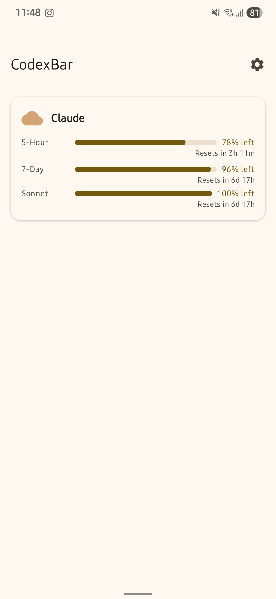
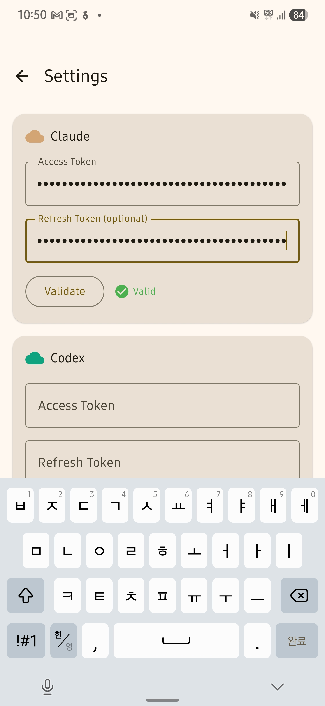

# CodexBar for Android

> Android port of [**CodexBar**](https://github.com/steipete/CodexBar) by [@steipete](https://github.com/steipete) — the macOS menu bar app for monitoring AI service quotas.

Monitor your AI service quotas from your Android device. Track remaining usage for Claude, Codex (ChatGPT), and Gemini in one place.

<p align="center">
  
  &nbsp;&nbsp;
  
</p>

## Features

- Real-time quota monitoring for Claude, Codex, and Gemini
- Animated gauge bars showing remaining usage percentage
- Quick Settings tile for at-a-glance status
- Background refresh with configurable intervals
- Persistent notification with per-service breakdown
- Encrypted credential storage
- Material 3 with Dynamic Color

## Setup

1. Clone and open in Android Studio
2. Build and install the debug APK
3. Open the app and go to **Settings** to enter your API tokens

## Getting Your Tokens

### Claude (Anthropic)

Claude uses OAuth tokens from Claude Code CLI. Extract from macOS Keychain:

```bash
security find-generic-password -s "Claude Code-credentials" -w \
  | python3 -c "import sys,json; print(json.loads(sys.stdin.read())['accessToken'])"
```

Paste the resulting token into the Claude access token field in Settings.

### Codex (OpenAI / ChatGPT)

If you have the [Codex CLI](https://github.com/openai/codex) installed and logged in, extract tokens from `~/.codex/auth.json`:

```bash
# Access token
cat ~/.codex/auth.json | python3 -c "import sys,json; print(json.loads(sys.stdin.read())['tokens']['access_token'])"

# Refresh token
cat ~/.codex/auth.json | python3 -c "import sys,json; print(json.loads(sys.stdin.read())['tokens']['refresh_token'])"
```

Paste both into the Codex fields in Settings.

<details>
<summary>Alternative: Extract from browser (if CLI is not installed)</summary>

1. Open [chatgpt.com](https://chatgpt.com) in your browser
2. Open DevTools (F12) > Network tab
3. Look for requests to `https://chatgpt.com/backend-api/`
4. Copy the `Authorization: Bearer ...` token from request headers

</details>

### Gemini (Google)

If you have the [Gemini CLI](https://github.com/google-gemini/gemini-cli) installed and logged in, extract tokens from `~/.gemini/oauth_creds.json`:

```bash
# Access token
cat ~/.gemini/oauth_creds.json | python3 -c "import sys,json; print(json.loads(sys.stdin.read())['access_token'])"

# Refresh token
cat ~/.gemini/oauth_creds.json | python3 -c "import sys,json; print(json.loads(sys.stdin.read())['refresh_token'])"
```

The OAuth client ID and secret are also needed for token refresh. Extract from the Gemini CLI installation:

```bash
# Find oauth2.js and extract client credentials
gemini_path=$(which gemini)
oauth_js="$(dirname "$gemini_path")/../lib/node_modules/@google/gemini-cli/node_modules/@google/gemini-cli-core/dist/src/code_assist/oauth2.js"
grep -oP "OAUTH_CLIENT_ID\s*=\s*['\"]\\K[^'\"]*" "$oauth_js"
grep -oP "OAUTH_CLIENT_SECRET\s*=\s*['\"]\\K[^'\"]*" "$oauth_js"
```

Paste all four values into the Gemini fields in Settings.

<details>
<summary>Alternative: Extract from browser (if CLI is not installed)</summary>

1. Open [gemini.google.com](https://gemini.google.com) in your browser
2. Open DevTools > Network tab
3. Find requests containing `batchexecute` or similar API calls
4. Copy the OAuth token from the `Authorization` header

</details>

## Build

```bash
./gradlew assembleDebug
```

APK output: `app/build/outputs/apk/debug/app-debug.apk`

## Tech Stack

- Kotlin 2.1.0, Jetpack Compose, Material 3
- Hilt (DI), Retrofit2 + OkHttp (networking)
- WorkManager (background sync), EncryptedSharedPreferences (security)
- KSP, kotlinx.serialization

## Acknowledgments

Based on [CodexBar](https://github.com/steipete/CodexBar) by Peter Steinberger.

## License

[MIT](LICENSE)
